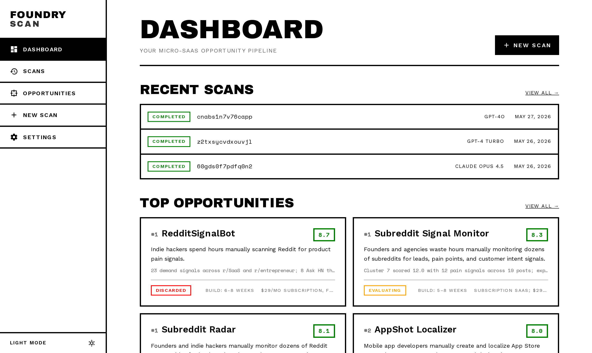

<p align="center">
  
</p>

<h1 align="center">FoundryScan</h1>

<p align="center"><strong>Open-source micro-SaaS opportunity discovery platform.</strong></p>

<p align="center">
  FoundryScan turns public discussions and trend signals into ranked micro-SaaS opportunities developers can evaluate and build.
</p>

<p align="center">
  No API keys required for most sources &nbsp;·&nbsp; No SaaS subscriptions &nbsp;·&nbsp; Runs entirely on your machine with Docker
</p>

---



---

## How it works

1. **Configure a scan** - enter keywords describing the space you want to explore (e.g. `"manual process"`, `"excel nightmare"`, `"wish there was a tool"`)
2. **Collect** - the backend retrieves Reddit posts and comments, Hacker News "Ask HN" threads, Google Trends data, and Product Hunt discussions in parallel
3. **Build a prompt** - collected raw data is assembled into a structured prompt optimized for LLM analysis
4. **Paste to your LLM** - copy the prompt, paste it into ChatGPT, Claude, Gemini, or any LLM of your choice, then paste the response back
5. **Review opportunities** - the app parses the LLM output into structured opportunity cards with scores, evidence, MVP features, and build estimates
6. **Track and export** - set statuses (`saved`, `evaluating`, `building`…), add personal notes, download individual opportunities as `.md` or `.txt`

---

## Features

- Multi-source collection: Reddit, Hacker News, Google Trends, Product Hunt
- Playwright fallback for JavaScript-rendered pages and bot-protection bypass
- Structured scoring: pain intensity, trend momentum, competition gap, MVP feasibility
- Infinite-scroll opportunity list with URL-persisted filters (status, sort, min score)
- Right-click / long-press context menu on opportunity cards (change status, download)
- Scan history with archive/delete and Active / Archived / All tabs
- Dark/light theme (RawBlock design system - no rounded corners, no shadows)
- Responsive mobile layout with slide-in navigation drawer
- Export: scan report as Markdown, individual opportunities as `.md` or `.txt`
- 10-minute hard timeout on collection, 30-day auto-cleanup of raw data
- Fully self-hosted - no external services required beyond an LLM of your choice

---

## Tech stack

| Layer | Technology |
|---|---|
| Frontend | Next.js 15 (App Router), React 19, Tailwind CSS v4 |
| Backend | FastAPI, Python 3.12, Pydantic v2 |
| Database | PocketBase (embedded SQLite, built-in migrations) |
| Collection | HTTPX, Playwright (headless Chromium fallback) |
| Trends | PyTrends |
| Container | Docker Compose |

---

## Quick start

### Prerequisites

- [Docker](https://docs.docker.com/get-docker/) with Compose v2
- ~1.5 GB disk space (Playwright Chromium + Python + Node deps)

### 1. Clone

```bash
git clone https://github.com/daiv05/foundry-scan.git
cd foundry-scan
```

### 2. Configure environment

```bash
cp backend/.env.example  backend/.env
cp frontend/.env.local.example  frontend/.env.local
```

Edit `backend/.env` - the only value you **must** change is `PB_ADMIN_PASSWORD`. Everything else works out of the box.

Optionally add a `PRODUCTHUNT_TOKEN` (free at [api.producthunt.com](https://api.producthunt.com/v2/oauth/applications)).

### 3. Build and run

```bash
docker compose up --build
```

First build takes 3–5 minutes. Subsequent starts are fast.

| Service | URL |
|---|---|
| Frontend | http://localhost:7110 |
| Backend API | http://localhost:7120/docs |
| PocketBase admin | http://localhost:7130/_/ |

### 4. Launch your first scan

1. Open http://localhost:7110
2. Click **New Scan** and enter keywords for your target market
3. Wait for collection to finish (~1–3 minutes)
4. Copy the generated prompt and paste it into your LLM
5. Copy the LLM response, go back to the scan page, and paste it in
6. Your ranked opportunities appear immediately

---

## Project structure

```
foundry-scan/
├── backend/
│   ├── app/
│   │   ├── routers/        HTTP endpoints (scans, opportunities, settings, configs)
│   │   ├── services/
│   │   │   ├── collector/  Per-source collectors (reddit, hn, trends, producthunt)
│   │   │   ├── scan_service.py     Orchestrates the full pipeline
│   │   │   ├── processor.py        Deduplicates and filters raw signals
│   │   │   ├── prompt_builder.py   Assembles the LLM prompt
│   │   │   ├── response_parser.py  Parses and persists LLM output
│   │   │   └── cleanup_service.py  Periodic raw-data expiry
│   │   ├── models/         Pydantic schemas
│   │   └── db.py           PocketBase async client
│   └── Dockerfile
├── frontend/
│   ├── src/
│   │   ├── app/            Next.js App Router pages
│   │   ├── components/     UI components (RawBlock design system)
│   │   ├── lib/            API client, types, export utilities
│   │   └── hooks/          useLongPress, etc.
│   └── Dockerfile
├── pocketbase/
│   ├── pb_migrations/      Schema migrations (auto-applied on start)
│   └── Dockerfile
├── docs/
│   ├── SPEC.md             Full product specification
│   └── features/           Per-feature implementation notes
└── docker-compose.yml
```

---

## Adding a new data source

1. Create `backend/app/services/collector/your_source.py` with an async `collect(keywords)` function that returns `list[dict]`
2. Register it in `scan_service.py` alongside the other collectors
3. Optionally add a config toggle in `backend/app/config.py`

See [`docs/features/F04-default-collector.md`](docs/features/F04-default-collector.md) for a reference implementation.

---

## Documentation

| Document | Contents |
|---|---|
| [LOCAL-SETUP.md](LOCAL-SETUP.md) | Full env variable reference, hot-reload dev workflow, rebuilding tips |
| [PROD-SETUP.md](PROD-SETUP.md) | Nginx reverse proxy config, Cloudflare Tunnel setup, Cloudflare Access |
| [FAQ.md](FAQ.md) | Why no LLM API, PocketBase rationale, common questions, dev tips |
| [CONTRIBUTING.md](CONTRIBUTING.md) | Code style, adding collectors, PR process |
| [LEGAL.md](LEGAL.md) | Data collection disclaimer, third-party ToS notes, responsible use |
| [docs/SPEC.md](docs/SPEC.md) | Full product specification |

---

## Contributing

See [CONTRIBUTING.md](CONTRIBUTING.md).

---

## License

[MIT](LICENSE) - free to use, modify, and distribute.

## Legal

FoundryScan collects publicly available data from third-party platforms for personal market research purposes. Users are responsible for complying with the terms of service of any platform from which data is collected. See [LEGAL.md](LEGAL.md) for full details.
